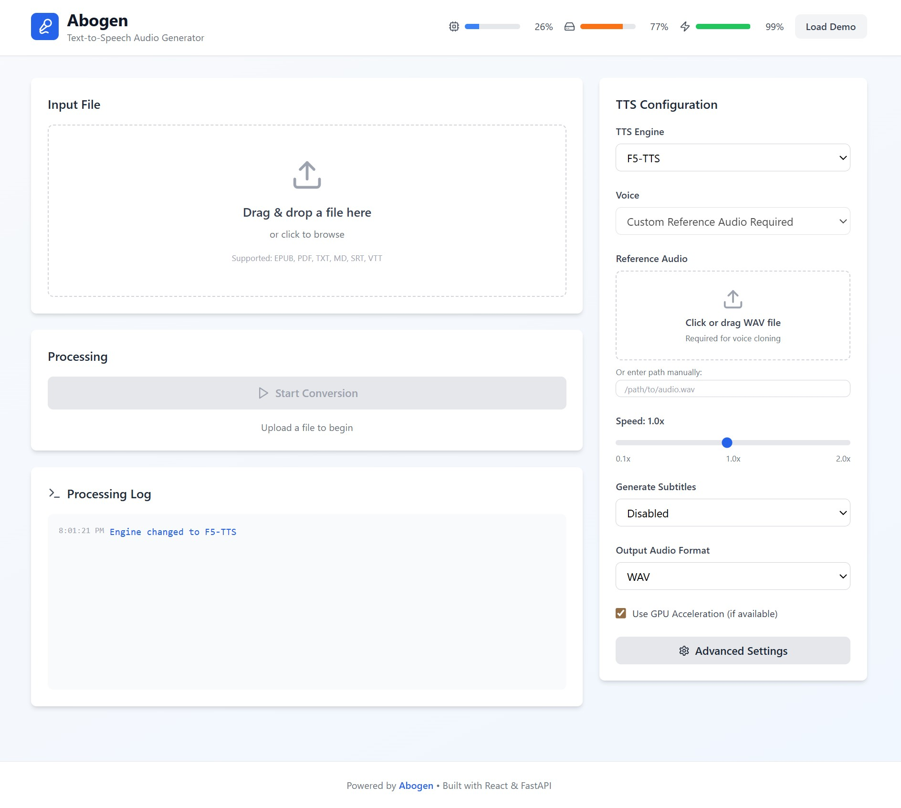

# Abogen Fork - WebUI + F5-TTS Edition

> ⚠️ **This is a personal fork** of the original [Abogen](https://github.com/denizsafak/abogen) project by [denizsafak](https://github.com/denizsafak). This is **not** the official project - it's a modified version adding a modern web interface and additional TTS engine support for personal use and fun.
>
> **All credit goes to the original Abogen project.** See [Original Project](#original-project) below.

## What's New in This Fork?

This fork adds **two main features** to the incredible Abogen project:

### 🌐 Modern Web UI
A responsive web interface to use Abogen remotely - run the backend on a server in your closet and access it from your laptop like a self-hosted application.



**Features:**
- 📁 Drag-and-drop file upload
- 🎤 Multiple TTS engines (Kokoro-82M, F5-TTS)
- ⚡ Real-time processing logs via WebSocket
- 📊 Live system monitoring (CPU, RAM, GPU)
- 🎯 Chapter/page selection
- 📝 Subtitle generation
- 🎚️ Speed control & voice customization
- 📱 Mobile-friendly responsive design

### 🔊 Additional TTS Engine Support
In addition to the default **Kokoro-82M**, this fork supports:
- **F5-TTS** - High-quality voice cloning and TTS synthesis from reference audio (fully tested and working)

## Quick Start - WebUI

```bash
# 1. Install Abogen and dependencies
pip install -e .
cd webui/backend && pip install -r requirements.txt
cd ../frontend && npm install

# 2. Start the backend (Terminal 1)
cd webui/backend
python main.py

# 3. Start the frontend (Terminal 2)
cd webui/frontend
npm run dev

# Open http://localhost:5173 in your browser
```

For detailed WebUI documentation, see [webui/README.md](webui/README.md).

## New Dependencies (WebUI Only)

**Backend:**
```
fastapi>=0.115.0
uvicorn[standard]>=0.32.0
python-multipart>=0.0.17
websockets>=13.0
pydantic>=2.9.0
psutil>=5.9.0
pynvml>=12.0.0
```

**Frontend:**
- React 19
- Vite
- Zustand
- Tailwind CSS
- Lucide React

## What's Working ✅

- **WebUI**: Full web interface with all major TTS features
- **Kokoro-82M**: Default TTS engine with 58 voices (stable)
- **F5-TTS**: High-quality voice cloning and TTS synthesis (tested and working in both Qt GUI and WebUI)
- **File Upload**: EPUB, PDF, TXT, MD, SRT, VTT support
- **Processing**: Real-time logs and progress tracking
- **Voice Profiles**: Save and load custom voice settings
- **Subtitles**: Multiple generation formats
- **System Monitor**: Live CPU, RAM, GPU metrics

## Tested Features ✅

Both the original Abogen Qt GUI and the new WebUI have been tested with:
- Kokoro-82M TTS synthesis
- F5-TTS voice cloning
- F5-TTS TTS synthesis

## What Might Not Work ⚠️

- **Some edge cases** in WebUI-specific features
- **Desktop GUI**: works but is janky with F5-TTS, logging and subs break.

## Original Project

**[Abogen](https://github.com/denizsafak/abogen)** is an amazing text-to-speech conversion tool for creating audiobooks from EPUB, PDF, text, markdown, or subtitle files.

### Why Use This Fork?
- Want to run Abogen on a server and access it from other machines? ✅ This fork has the WebUI
- Want to try F5-TTS voice cloning alongside Kokoro? ✅ This fork supports it (tested and working)
- Want the official, full-featured Abogen? ✅ Use the [original project](https://github.com/denizsafak/abogen)

### Original Installation & Features
For complete installation instructions, detailed configuration options, troubleshooting, and the full feature set, please refer to the **[official Abogen repository](https://github.com/denizsafak/abogen)**.

This includes:
- Detailed OS-specific installation guides
- Complete configuration documentation
- Voice mixer feature details
- Queue mode
- Desktop GUI
- And much more...

## Architecture

```
abogen/
├── webui/
│   ├── backend/           # FastAPI REST API + WebSocket
│   │   └── main.py       # TTS conversion server
│   ├── frontend/         # React + Vite web interface
│   │   └── src/         # Components, state, styling
│   └── screenshot.jpg    # WebUI demo image
├── abogen/               # Original Abogen library
└── README.md             # This file
```

## Technology Stack

**Backend:**
- FastAPI (async REST API)
- WebSockets (real-time updates)
- Uvicorn (ASGI server)

**Frontend:**
- React 19
- Vite
- Zustand (state management)
- Tailwind CSS

## Development

The backend includes automatic API docs at `http://localhost:8000/docs`

For development setup and API details, see [webui/README.md](webui/README.md).

## License

MIT (same as original Abogen)

## Credits

- **Original Project**: [Abogen](https://github.com/denizsafak/abogen) by [denizsafak](https://github.com/denizsafak)
- **TTS Engines**: [Kokoro](https://github.com/hexgrad/kokoro), [F5-TTS](https://github.com/SWivid/F5-TTS)
- **WebUI Stack**: React, Vite, FastAPI, and the amazing open-source community

---

> **Note**: This is a personal fork for personal use and experimentation. For the complete, official Abogen experience, please use the [original repository](https://github.com/denizsafak/abogen).
